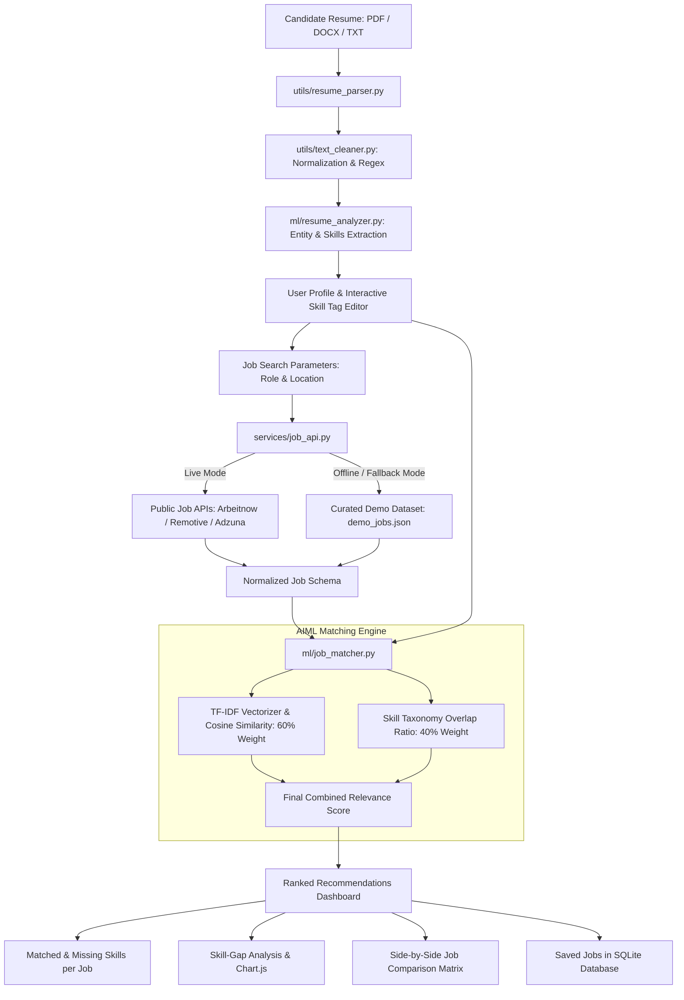

# JobMatch AI — AI-Based Resume Analysis and Job Recommendation System

> **College AIML Capstone Project**  
> *A full-stack, decision-support web application that extracts candidate skills and credentials using Natural Language Processing (NLP), retrieves current job postings from legitimate job APIs, computes mathematical relevance using TF-IDF Vectorization and Cosine Similarity, and provides actionable market skill-gap insights.*

---

## 1. Project Overview & Problem Statement

### Problem Statement
Job seekers and college graduates often struggle to understand how well their resumes align with current employer requirements. Traditional keyword search engines either look for exact word matches or rely on obscure proprietary black-box algorithms. Furthermore, candidates rarely receive actionable feedback regarding **which specific skills they are missing** for the roles they desire.

### Proposed Solution
**JobMatch AI** bridges this gap as an intelligent, transparent decision-support system. It:
1. Parses resumes in **PDF, DOCX, and TXT** formats.
2. Extracts candidate skills, education, experience, and certifications using NLP.
3. Allows candidates to inspect and manually edit/refine detected skills.
4. Retrieves live job openings from legitimate external job APIs with a transparent offline demo data fallback.
5. Computes a transparent **Resume–Job Relevance Score** using scikit-learn's **TF-IDF Vectorizer + Cosine Similarity** (60% weight) combined with exact **Skill Overlap Ratio** (40% weight).
6. Highlights matched skills (in green) and missing skills (in amber) for each job card.
7. Conducts **Skill-Gap Analysis** across top matching openings, displaying in-demand missing skills via Chart.js.
8. Provides side-by-side multiple job comparison and persistent job bookmarking.

> [!NOTE]
> **Decision-Support Disclaimer:** This application is designed as a candidate recommendation and career-guidance tool, **not** an automated hiring or candidate-rejection system. It does not determine employability or guarantee hiring outcomes.

---

## 2. System Architecture



---

## 3. AIML Methodology & Mathematical Formulations

### Step-by-Step NLP & ML Pipeline

1. **Document Text Extraction:**  
   `pypdf` extracts text streams across all PDF pages; `python-docx` parses paragraphs and tables; multi-encoding reader parses plain text.
2. **Preprocessing & Normalization:**  
   Unicode normalization (NFKD), removal of binary control characters, standardizing bullet points, and collapsing multi-whitespace.
3. **NLP Skill & Entity Extraction:**  
   Uses regex boundary patterns with case-insensitive tokenization against a standardized taxonomy spanning Programming Languages, Web Technologies, Databases, Cloud/DevOps, and Data Science/AI.
4. **TF-IDF Vectorization:**  
   The candidate resume text and each job description are transformed into high-dimensional feature vectors.
   $$\text{TF-IDF}(t, d, D) = \text{TF}(t, d) \times \text{IDF}(t, D)$$
   Where:
   - $\text{TF}(t, d)$: Term frequency of word $t$ in document $d$ (using sublinear term frequency $1 + \log(\text{TF})$).
   - $\text{IDF}(t, D) = \log\left(\frac{1 + |D|}{1 + |\{d \in D : t \in d\}|}\right) + 1$: Inverse document frequency discounting common non-informative words.
   - N-gram range: $(1, 2)$ to capture unigrams (e.g. `Python`) and bigrams (e.g. `Machine Learning`, `Data Analysis`).
5. **Cosine Similarity Calculation:**  
   Measures the cosine of the angle between the normalized TF-IDF resume vector $\vec{u}$ and job vector $\vec{v}$:
   $$\text{Cosine Similarity}(\vec{u}, \vec{v}) = \frac{\vec{u} \cdot \vec{v}}{\|\vec{u}\| \|\vec{v}\|} = \frac{\sum_{i=1}^n u_i v_i}{\sqrt{\sum_{i=1}^n u_i^2} \sqrt{\sum_{i=1}^n v_i^2}}$$
6. **Skill Overlap Ratio:**  
   Compares candidate skills with employer required skills:
   $$\text{Skill Overlap Ratio} = \frac{|\text{Candidate Skills} \cap \text{Job Required Skills}|}{\max(|\text{Job Required Skills}|, 1)}$$
7. **Transparent Final Relevance Score:**  
   $$\text{Final Relevance Score} = \Big(\text{Cosine Similarity} \times 0.60 + \text{Skill Overlap Ratio} \times 0.40\Big) \times 100$$
8. **Skill-Gap Analysis:**  
   Aggregates missing skills across the top $N$ recommended openings, calculates employer demand frequencies, and ranks technologies for upskilling.

---

## 4. Technology Stack

| Layer | Technology | Purpose |
| :--- | :--- | :--- |
| **Frontend** | HTML5, CSS3, JavaScript (ES6+), Bootstrap 5 | Clean, responsive UI with light/dark contrast and accessibility |
| **Data Visualization** | Chart.js (CDN) | Interactive skill-gap frequency bar chart |
| **Backend Framework** | Python 3.13, Flask 3.1 | REST-style routing, blueprint modularity, session management |
| **Database** | SQLite 3 | Embedded persistent store for analyses, saved jobs, and audit logs |
| **Machine Learning** | scikit-learn, NumPy | TF-IDF vectorizer and Cosine Similarity computations |
| **Document Parsers** | pypdf, python-docx | Text extraction from PDF, DOCX, and TXT files |
| **External APIs** | requests, python-dotenv | HTTP client for live job board integration |

---

## 5. External Job API Integration & Fallback Strategy

To satisfy college project requirements for legitimate, current job openings:

1. **Primary Live Providers (No Key Required):**
   - **Arbeitnow API:** `https://www.arbeitnow.com/api/job-board-api`  
     Provides live software engineering openings with company names, locations, full job descriptions, tags, and direct application links.
   - **Remotive API:** `https://remotive.com/api/remote-jobs`  
     Provides live remote developer roles worldwide.
2. **Configurable Targeted Provider (Adzuna API):**
   - Supports targeted search across Indian metropolitan hubs (Bengaluru, Hyderabad, Chennai, Mumbai, Delhi, Pune) if `ADZUNA_APP_ID` and `ADZUNA_APP_KEY` are provided in `.env`.
3. **Transparent Demo Data Fallback:**
   - If network connectivity is unavailable or the external API returns no results, the system seamlessly activates a curated demo dataset (`data/demo_jobs.json`).
   - The UI displays a prominent badge:  
     `DEMO DATA — NOT LIVE JOB OPENINGS (API Offline Fallback)`  
     Ensuring full transparency as required by project specifications.

---

## 6. Real vs Demo / Fallback Features

| Feature | Classification | Description |
| :--- | :---: | :--- |
| Resume Text Extraction (PDF/DOCX/TXT) | **REAL** | Reads actual binary streams and paragraphs using `pypdf` and `python-docx` |
| NLP Skills & Education Extraction | **REAL** | Deterministic regex taxonomy extraction with boundary matching |
| Interactive Skill Tag Editor | **REAL** | Allows live additions and deletions synced to SQLite via REST API |
| TF-IDF & Cosine Similarity Math | **REAL** | scikit-learn mathematical computation, strictly un-faked |
| Live Job API Retrieval | **REAL** | Calls Arbeitnow & Remotive live HTTP endpoints |
| Demo Data Fallback Mode | **FALLBACK** | Activated only when network is unavailable or API credentials are empty |
| Side-by-Side Job Comparison | **REAL** | Computes skill intersection across any 2 to 4 selected jobs |
| Skill-Gap Analysis & Chart | **REAL** | Computes exact frequencies of missing skills across recommended jobs |
| Save / Unsave Jobs | **REAL** | Persisted in SQLite `saved_jobs` table per session |
| System Search Audit Log | **REAL** | Persisted in SQLite `job_search_history` table |

---

## 7. Project Directory Structure

```
RESUMR/
├── app.py                          # Flask app factory and entry point
├── config.py                       # Configuration constants and environment loader
├── requirements.txt                # Python dependencies
├── .env.example                    # Template for environment variables
├── .env                            # Active environment configuration
├── README.md                       # Comprehensive documentation and viva guide
│
├── models/
│   ├── __init__.py
│   └── database.py                 # SQLite schema, queries, and helper functions
│
├── services/
│   ├── __init__.py
│   └── job_api.py                  # Live API clients (Arbeitnow, Remotive, Adzuna) & fallback
│
├── ml/
│   ├── __init__.py
│   ├── skills_dictionary.py        # Standardized skills taxonomy & regex compiler
│   ├── resume_analyzer.py          # Extraction of skills, education, experience, roles
│   └── job_matcher.py              # TF-IDF, Cosine Similarity, Skill Overlap, Gap analysis
│
├── utils/
│   ├── __init__.py
│   ├── resume_parser.py            # PDF, DOCX, TXT file decoders & validators
│   └── text_cleaner.py             # Whitespace normalizer & NLP text cleaner
│
├── routes/
│   ├── __init__.py
│   ├── resume_routes.py            # /upload, /analysis, /api/update-skills
│   ├── job_routes.py               # /jobs, /job/<id>, /compare, /api/save-job, /api/unsave-job
│   └── dashboard_routes.py         # /, /dashboard, /saved-jobs, /admin
│
├── templates/
│   ├── base.html                   # Responsive navbar, alerts, footer
│   ├── index.html                  # Homepage with workflow and formula overview
│   ├── upload.html                 # Drag-and-drop file upload interface
│   ├── analysis.html               # Detected profile entities and interactive skill tag editor
│   ├── jobs.html                   # Ranked jobs, score badges, filters, sorting, compare selector
│   ├── job_details.html            # Single job breakdown with TF-IDF vs Skill math
│   ├── dashboard.html              # Metrics cards and Chart.js skill gap chart
│   ├── saved_jobs.html             # Bookmarked jobs manager
│   ├── comparison.html             # Multi-job side-by-side comparison matrix
│   └── admin.html                  # Search audit logs and taxonomy viewer
│
├── static/
│   ├── css/
│   │   └── style.css               # Clean professional styling tokens and components
│   └── js/
│       └── app.js                  # Dropzone, tag editor, async bookmarks, comparison selector
│
├── data/
│   └── demo_jobs.json              # Curated offline fallback dataset labeled as demo data
│
├── sample_resumes/                 # Pre-generated sample resumes for testing
│   ├── sample_python_developer.pdf # Valid PDF resume (B.Tech, 2 yrs, Python/Flask/SQL)
│   ├── sample_data_analyst.docx    # Valid DOCX resume (Data Analyst, Python/Pandas/PowerBI)
│   └── sample_frontend_dev.txt     # Valid TXT resume (Frontend, React/JS/HTML/CSS)
│
├── tests/                          # Complete automated test suite (22 test cases)
│   ├── __init__.py
│   ├── test_parser.py              # PDF, DOCX, TXT, invalid file, and empty resume tests
│   ├── test_matcher.py             # TF-IDF, Cosine similarity, formula, and skill gap tests
│   ├── test_api.py                 # API normalization, deduplication, and fallback tests
│   └── test_routes.py              # End-to-end route tests, API tests, session tests
│
└── instance/
    └── jobmatch.db                 # SQLite database file
```

---

## 8. Installation & Setup

### Prerequisites
- Python 3.10 or higher (tested on Python 3.13)
- `pip` package manager

### Step 1: Clone or Navigate to Project
```bash
cd "c:\Users\PARAMESH S\OneDrive\Desktop\RESUMR"
```

### Step 2: Install Dependencies
```bash
pip install -r requirements.txt
```

### Step 3: Configure Environment Variables
Copy `.env.example` to `.env`:
```bash
cp .env.example .env
```
Open `.env` and verify settings:
```ini
SECRET_KEY=jobmatch_ai_development_secret_key_2026
FLASK_ENV=development
DEBUG=True

# Public APIs (Arbeitnow & Remotive) run out-of-the-box with no keys.
# Optional: add Adzuna credentials for targeted Indian city searches:
ADZUNA_APP_ID=
ADZUNA_APP_KEY=

# Set to True if you wish to force offline Demo Data mode:
FORCE_DEMO_DATA=False
```

---

## 9. How to Run the Application

### Start the Flask Server:
```bash
python app.py
```
Output:
```
 * Serving Flask app 'app'
 * Running on http://127.0.0.1:5000
```

### Open in Browser:
Navigate to:
```
http://127.0.0.1:5000
```

---

## 10. Running the Automated Test Suite

Run the full suite of 22 unit and integration tests:
```bash
python -m unittest discover tests
```
Output:
```
......................
----------------------------------------------------------------------
Ran 22 tests in 0.236s

OK
```

---

## 11. College Viva / Interview Q&A Guide

#### Q1: What is TF-IDF and why is it used instead of simple keyword frequency?
**Answer:** Simple Term Frequency (TF) counts how often a word occurs, which unfairly favors ubiquitous words like "is", "the", or "developer". TF-IDF (*Term Frequency-Inverse Document Frequency*) offsets this by multiplying TF with IDF: words that appear across almost all documents get penalized, while domain-specific terms (such as "PyTorch", "Kubernetes", "PostgreSQL") receive higher numerical weights.

#### Q2: What is Cosine Similarity and why is it preferred over Euclidean Distance for text?
**Answer:** Euclidean distance measures the straight-line distance between two point coordinates, which is distorted by document length (a 5-page resume would look very distant from a 1-paragraph job post even if they discuss the exact same tools). Cosine similarity measures the **cosine of the angle** between two vectors regardless of vector magnitude:
$$\cos(\theta) = \frac{\vec{u} \cdot \vec{v}}{\|\vec{u}\| \|\vec{v}\|}$$
This ensures that length differences do not distort semantic relevance.

#### Q3: Why combine TF-IDF Cosine Similarity with explicit Skill Overlap?
**Answer:** Pure text similarity can be misled by generic prose, company history, or boilerplate job descriptions. Conversely, pure keyword matching ignores relevant contextual domain vocabulary. Combining both:
$$\text{Score} = (\text{Text Similarity} \times 0.60) + (\text{Skill Overlap Ratio} \times 0.40)$$
provides both contextual breadth and strict technical verification.

#### Q4: Why is an "Edit Skills" feature provided to candidates?
**Answer:** Automated NLP extraction from arbitrary PDF layouts is not 100% infallible due to varied font encodings, complex multi-column formatting, and informal skill phrasing. Allowing candidates to add or delete skills empowers them with control and transparently addresses parsing edge cases.

#### Q5: How is this system ethical and aligned with AI decision-support principles?
**Answer:** JobMatch AI is strictly presented as a **candidate recommendation and guidance tool**. It explicitly does not automate hiring or candidate rejection, does not score candidate "hireability", and clearly labels demo versus live data sources.

---

## 12. Known Limitations & Future Enhancements

1. **Scanned Image Resumes:** Currently, only text-based PDFs and Word documents are supported. Future enhancements could integrate Tesseract OCR for scanned image PDFs.
2. **Dense Vector Embeddings:** The system uses statistical TF-IDF. Future iterations could incorporate Transformer-based sentence embeddings (e.g. `all-MiniLM-L6-v2` via Sentence-Transformers) for deeper contextual nuance.
3. **Direct Application Tracking:** Currently provides direct external application links. Future versions could include a kanban board to track application submission statuses.
# jobjy

